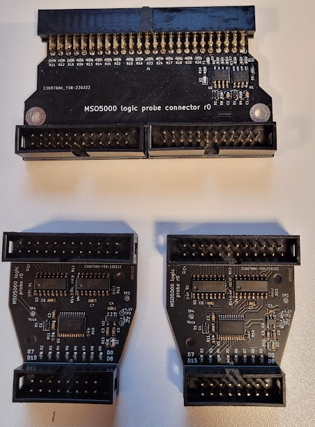
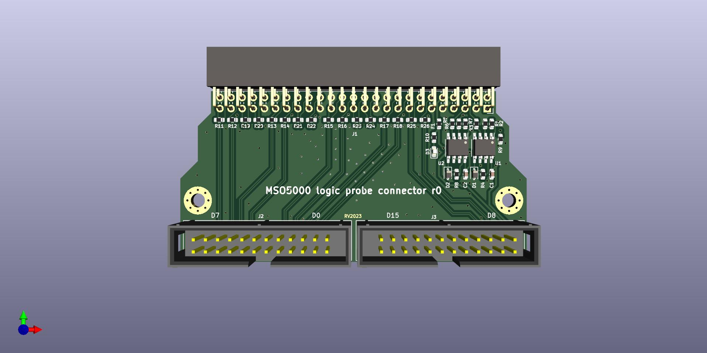
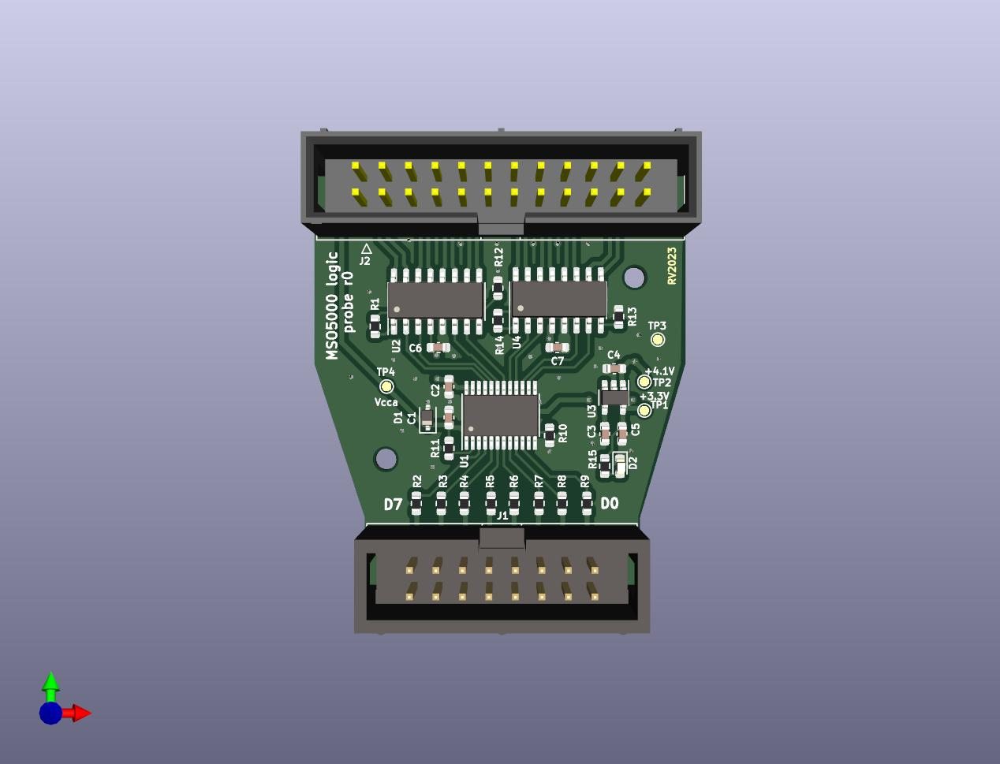

# MSO5000 logic analyzer probe

This project aims to be a somewhat lower performance but significantly cheaper alternative to Rigol's PLA2216 
logic analyzer probe for MSO5000-series oscilloscopes.

The project is based on the design published by Gandalf_Sr on [EEVBlog forum](https://www.eevblog.com/forum/testgear/ms05000-budget-logic-analyzer-probe-set-design/), 
with the most notable difference being that it should allow input signal threshold selection from the oscilloscope.

The project consists of two PCBs: 

* __connector-pcb__ which plugs into oscilloscope,
* 2x __probe-pcb__'s which connect to the aforementioned PCB via 24-pin IDC cables.

As the original design, it aims to support ~1-5V logic levels up to 100MHz. The probe PCBs can be built with 
two different TI level-shifters:

* SN74AXC8T245 with specified input range of 0.65-3.6V (4.2V abs. max).
* SN74**L**XC8T245 with specified input range of 1.1-5.5V (6.2V abs. max).

Do note that the propagation delay for lower input voltages can limit the observable signal's bandwidth!

## Current status

Revision 0 of both PCBAs has been assembled and passed basic function checks. The only required change was that series resistor
for ProbeDet signal was apparently too high (10K->100R).

Do keep in mind that the threshold level set in scope is not executed faitfhully- it's essentially amplified with a gain of 16.8
and provided as Vcc for SN74AXC8T245. See the datasheet of SN74AXC8T245 and connector-pcb/threshold-vcc-gain-calc.ods spreadsheet for details.

## Connector PCB

## Probe PCB

